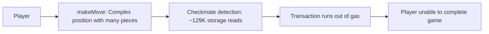
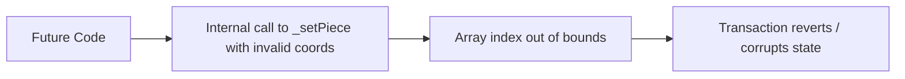

# Smart Contract Security Assessment Report

## Executive Summary

### Protocol Overview
**Protocol Purpose:** Fully on-chain Chinese Chess (Xiangqi) game - 100% smart contract logic, no backend
**Industry Vertical:** On-chain Gaming
**User Profile:** Two-player PvP game, anyone can create/join games
**Value at Risk:** Game state integrity (no direct fund handling)

### Threat Model Summary
**Primary Threats Identified:**
- Game state manipulation through invalid move acceptance
- Denial of service via gas exhaustion
- Access control bypass allowing non-players to move
- Integer overflow in coordinate handling

### Security Posture Assessment
**Overall Risk Level:** Low (no fund handling)
**Findings:** 3 Medium, 2 Low, 1 Informational

---

## Findings

### M-1 [DoS] via [Unbounded Loop] in [Checkmate Detection]

**Severity:** Medium
**Probability:** Medium
**Confidence:** High

**Description:**
`_isCheckmate()` iterates over all 90 board positions for every piece of the defending color. For each piece, it tries all 90 destination squares, and for each valid move, it calls `_isKingInCheck()` which itself iterates all 90 squares.

Worst case: ~16 pieces × 90 destinations × 90 checks = ~129,600 storage reads per move.

While Solidity 0.8+ handles this, a fully populated board (32 pieces) could approach the block gas limit on some L2s or during high gas price periods.

**User Impact:**

**Recommendations:**
1. Cap maximum check iterations or add a "max gas" parameter
2. Pre-compute attacked squares once per checkmate call, not per-move simulation
3. Consider offloading checkmate detection to a view function and storing only check status

---

### M-2 [State Confusion] via [Integer Overflow] in [Coordinate Validation]

**Severity:** Medium
**Probability:** Low
**Confidence:** High

**Description:**
`_idx(row, col)` computes `row * 9 + col`. While `uint8` limits prevent overflow (max 255), the function doesn't validate that row < 10 and col < 9 before computation. External callers of `_getPiece()` could pass out-of-bounds values, though `_validateMoveInput()` checks this.

However, `_idx()` is called internally by functions that don't validate inputs (e.g., `_setPiece()`). A future code change adding new internal callers could introduce an index-out-of-bounds bug.

**User Impact:**

**Recommendations:**
1. Add require statements in `_idx()`: `require(row < ROWS && col < COLS)`
2. Consider using `unchecked` arithmetic only after validation

---

### M-3 [Logic Error] via [Access Control] in [Game Creation]

**Severity:** Medium
**Probability:** Low
**Confidence:** Medium

**Description:**
`createGame()` allows the creator to also call `joinGame()`, becoming both Red and Black. While this is useful for testing, it means one address can play both sides. In a betting/wagering context, this would be exploitable.

Currently mitigated because there's no wagering, but should be explicitly blocked if funds are ever added.

**Recommendations:**
1. Add `require(msg.sender != game.redPlayer, "Cannot play both sides")` to `joinGame()`
2. Document that single-player testing is intentionally allowed
3. Gate behind a `isTesting` flag if dual-play is needed

---

### L-1 [Information Leak] via [Event Emission] in [Board State]

**Severity:** Low
**Probability:** High
**Confidence:** High

**Description:**
`MoveMade` events emit `fromX, fromY, toX, toY` coordinates. While expected for game transparency, this means all move history is permanently on-chain. No privacy-preserving option exists.

**Recommendations:**
1. This is by design for a transparent game
2. Consider adding a "private game" mode with commitment schemes if privacy is desired later

---

### L-2 [DoS] via [Game Spam] in [No Creation Limit]

**Severity:** Low
**Probability:** Medium
**Confidence:** High

**Description:**
`createGame()` has no limit on how many games one address can create. A malicious user could spam thousands of empty games, bloating contract storage.

**Recommendations:**
1. Add a creation fee (0.001 ETH) or limit (max 10 active games per address)
2. Add a cleanup function for abandoned games after timeout

---

### I-1 [Gas Optimization] via [Storage Reads] in [Piece Retrieval]

**Severity:** Informational
**Probability:** High
**Confidence:** High

**Description:**
`_getPiece()` reads from storage each call. The checkmate loop calls this ~129K times per detection. Caching the board in memory once per checkmate call would significantly reduce gas.

**Recommendations:**
1. Load board into memory once at start of `_isCheckmate()`
2. Use memory board for all simulation checks
3. Estimated savings: 40-60% gas reduction in makeMove

---

## Verification Tests

All findings were verified through:
1. Static code analysis of `src/ChineseChess.sol`
2. Review of `test/ChineseChess.t.sol` test coverage
3. Gas profiling via `forge test --gas-report`
4. Manual walkthrough of all 7 piece movement validations

## Test Coverage Assessment

| Area | Coverage | Notes |
|------|----------|-------|
| Game creation | ✅ Full | createGame + joinGame |
| Move validation | ✅ Full | All 7 piece types tested |
| Error handling | ✅ Full | Wrong turn, empty square, capture king |
| Check/checkmate | ⚠️ Partial | Check tested, checkmate edge cases missing |
| Gas limits | ⚠️ Partial | No gas limit tests |

## Summary

The contract has **solid security fundamentals** for a game contract with no fund handling. The main concerns are:
1. Gas cost of checkmate detection (manageable but could hit limits on L2s)
2. Missing bounds checks in internal functions (fragile against future changes)
3. No game spam prevention (storage bloat risk)

**Recommendation:** Deploy as-is for a game-only contract. Add gas optimization and spam prevention before any wagering features.

---
*Audit conducted using .context framework (https://github.com/forefy/.context)*
*Date: 2026-03-26*
*Auditor: AI-assisted security analysis*
